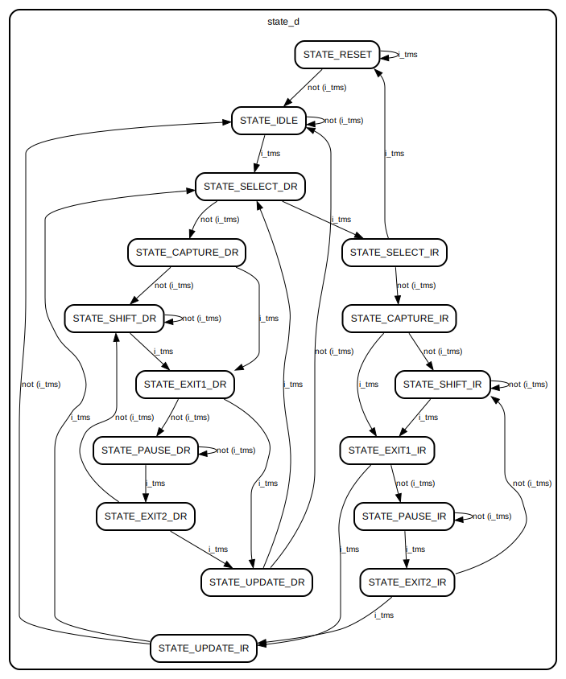

# A Basic JTAG Implementation
The intent of this repository is to get a better understanding of JTAG implementations in ASICs.

A great resource that explains low level implementation details simply is this blog post: https://interrupt.memfault.com/blog/diving-into-jtag-part1. This implementation closely tries to follow part 1 of the series of blogs and
elaborates on HDL implementation specific details.

## RTL
### jtag.sv

This module is the top level that connects the sub-modules together. The diagram
below shows the sub-modules interconnected.

### jtag_tap.sv

This module implements the JTAG TAP which is a simple FSM whose next state is
determined by the JTAG input `i_tms` (and current state).

The diagram below shows the FSM as interpreted by Yosys:

### jtag_shiftReg.sv

This module implements the JTAG shift register which performs the following
functions for the IR/DR:
- Shift data in from `i_tdi` if the TAP is in STATE_SHIFT_DR or STATE_SHIFT_IR.
  Data is shifted into the LSB and the shifted out of the MSB.
- Capture (load) in data from IR/DR if the TAP is in STATE_CAPTURE_IR or
  STATE_CAPTURE_DR. Following the blog, if the TAP is in STATE_CAPTURE_IR, then
  `IR_SCAN_CODE` is loaded.

The schematic below shows its implementation:

### jtag_instrReg.sv

This module implements the JTAG instruction register which is set to the data
stored in the shift register when the TAP is in STATE_UPDATE_IR.

Its schematic can be found in `docs/jtag_instrReg.svg`.

### jtag_dataReg.sv

This module implements the JTAG data register which comprises of the following
set of registers:
- IDCODE regsister: Stores the unique `ID_CODE` of the device.
- Boundary scan register: Assumed to be driven from the devices BSRs.
- Bypass register: A 1 bit register which when selected (and the TAP is in
  STATE_CAPTURE_DR) sets the MSB of the shift register.
- User register (to represent any arbitrary register) that needs to be written
  by JTAG. When the TAP is in STATE_UPDATE_DR, it gets set to the value
  stored in the shift register.

The registers are muxed together and the current value of the instruction regsiter selects which register to connect to the output (which is connected
to the shift reg).

Its schematic can be found in `docs/jtag_dataReg.svg`.

**Note:**
See: https://github.com/tms4517/Yosys_to_aid_with_RTL_design on how to generate
schematics and FSM diagrams.

## TB

Shift register shifting data in from `i_tdi` and shifting the data out 32 clock
cycles later from `o_tdo`.

TAP set to capture IR state where the device `IR_SCAN_CODE` is loaded into the
shift register 1 clock sycle after `o_stateIsShiftIr`. The `IR_SCAN_CODE` is 
then shifted out of `o_tdo` 32 clock cycles later.

