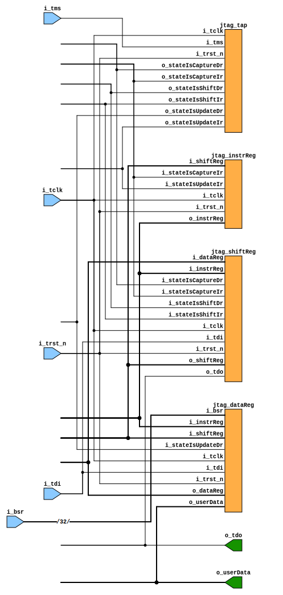

# A Basic JTAG Implementation
The intent of this repository is to get a better understanding of JTAG implementations in ASICs.

A great resource that explains low level implementation details simply is this blog post: https://interrupt.memfault.com/blog/diving-into-jtag-part1. This implementation closely tries to follow part 1 of the series of blogs and
elaborates on HDL implementation specific details.

## RTL
### jtag.sv

This module is the top level that connects the sub-modules together. The diagram
below shows the sub-modules interconnected.



### jtag_tap.sv

This module implements the JTAG TAP which is a simple FSM whose next state is
determined by the JTAG input `i_tms` (and current state).

The diagram below shows the FSM as interpreted by Yosys:


### jtag_shiftReg.sv

This module implements the JTAG shift register which performs the following
functions for the IR/DR:
- Shift data in from `i_tdi` if the TAP is in STATE_SHIFT_DR or STATE_SHIFT_IR.
  Data is shifted into the LSB and the shifted out of the MSB.
- Capture (load) in data from IR/DR if the TAP is in STATE_CAPTURE_IR or
  STATE_CAPTURE_DR. Following the blog, if the TAP is in STATE_CAPTURE_IR, then
  `IR_SCAN_CODE` is loaded.

The schematic below shows its implementation:


### jtag_instrReg.sv

This module implements the JTAG instruction register. When the TAP is in
`STATE_UPDATE_IR`, the IR is set to the data shifted into the shift register.
When the TAP is in `STATE_CAPTURE_IR`, it is set to the `IR_SCAN_CODE`, so that the shift register can shift the value out.

Its schematic can be found in `docs/jtag_instrReg.svg`.

### jtag_dataReg.sv

This module implements the JTAG data register which comprises of the following
set of registers:
- IDCODE regsister: Stores the unique `ID_CODE` of the device.
- Boundary scan register: Assumed to be driven from the devices BSRs.
- Bypass register: A 1 bit register which when selected (and the TAP is in
  STATE_CAPTURE_DR) sets the MSB of the shift register.
- User register (to represent any arbitrary register) that needs to be written
  by JTAG. When the TAP is in STATE_UPDATE_DR, it gets set to the value
  stored in the shift register.

The registers are muxed together and the current value of the instruction regsiter selects which register to connect to the output (which is connected
to the shift reg).

Its schematic can be found in `docs/jtag_dataReg.svg`.


## TB

A basic directed TB was created using verilator. The TB consists of various
functions that set the TAP to a particular state by driving the `i_tms` port, shifting data in by driving the `i_tdi` port and visually confirming the
expected data is driven on the `o_tdo` port.

The following functions have been created to demonstrate the JTAG functionality.

### demonstrate_ShiftDataInThenOut

The TAP is set to `STATE_SHIFT_DR` by driving the `i_tms` pin 0 -> 1 -> 0 -> 0
on successive clock cycles. On successive clock cycles, data 1 -> 0 -> 1 -> 0
-> 1 -> 0 is shifted into the shift register by driving the `i_tdi` pin. 32 clock cycles later the sequence of data is driven out of `o_tdo`. This is
indicated by the red markers shown in the figure below.


To run the simulation and generate the waveform:
```
cd tb && make -f Makefile1 all
```

### demonstrate_CaptureIrShiftIr

The TAP is set to `STATE_CAPTURE_IR` by driving the `i_tms` pin 0 -> 1 -> 1 -> 0
on successive clock cycles. This is indicated by the red markers in the image below. 1 clock cycle later, the shift register is set to 32'b1 which is the
`IR_SCAN_CODE`. The TAP is then reset by by asserting `i_tms` for 5 clock
cycles. This is indicated by the blue marker. The TAP is then set to
`STATE_SHIFT_IR` by driving `i_tms` 0 -> 1 -> 1 -> 0 -> 0 on successive clock
cycles. This is indicated by the yellow marker. 32'b1 is shifted out 32 clock
cycles later.


To run the simulation and generate the waveform:
```
cd tb && make -f Makefile2 all
```

### demonstrate_setIrShiftDr

The TAP is set to `STATE_SHIFT_IR` by driving the `i_tms` pin 0 -> 1 -> 1 -> 0  -> 0 on successive clock cycles. THis is indicated by the yellow marker. The BSR
instruction opcode (32'd3) is then shifted into the shift register. This is
indicated by the grey marker. The TAP is then set to `STATE_UPDATE_IR` and this
updates the IR on the following clock cycle with the BSR opcode. This is
indicated by the orange marker. The instruction register forms the select
line of the data register MUX and as a result the BSR is MUXed to `o_dataReg`.
The TAP is then set to `STATE_CAPTURE_DR` and this updates the shift register with the BSR data. This is indicated by the pink marker. The TAP is then set to `STATE_SHIFT_DR` and the BSR is shifted out to the tdo pin. This is indicated
by the blue marker.


To run the simulation and generate the waveform:
```
cd tb && make -f Makefile3 all
```
**Note:** IP likely contains bugs.
